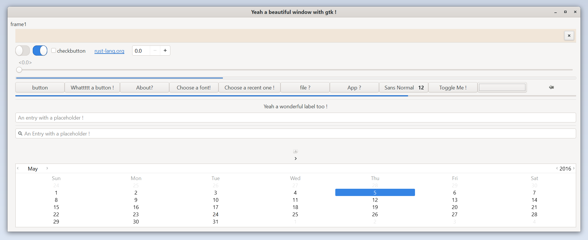
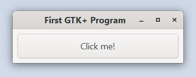
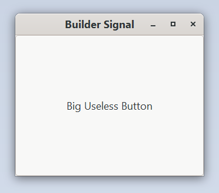
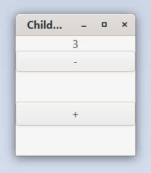
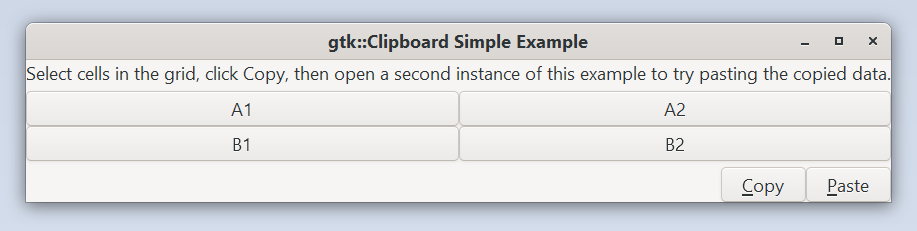
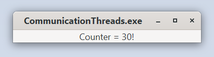
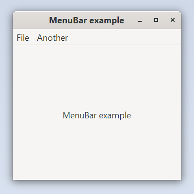
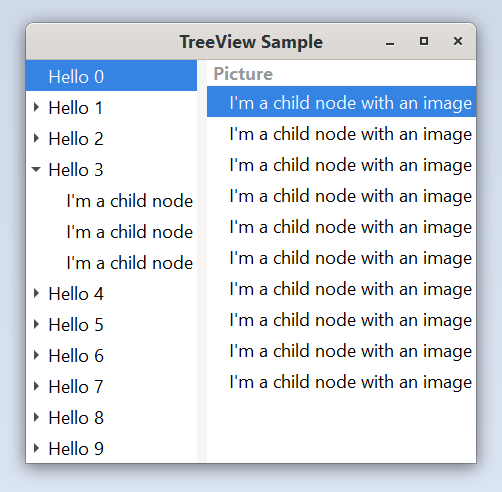
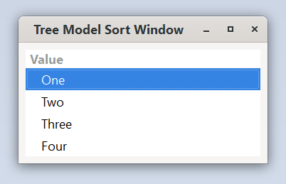

# gtk-rs examples 

A few gtk-rs examples. To build, just do:

```Shell
> cargo build
```

or to enable GTK 3.x depending on the version needed by the example (check Cargo.toml `[features]` to see all specific GTK compile features available):

```Shell
> cargo build --features gtk_3_18
> cargo build --all-features
```

And then run the executables with:

``` Shell
./target/debug/EXAMPLE-NAME
```

or with cargo run (repeating the compilation features used above), example:

``` Shell
cargo run --all-features --bin EXAMPLE-NAME
```

Please be sure to have installed all the required libraries before building examples (the list is available on the [gtk-rs](https://github.com/gtk-rs/gtk/) repository).

## Example Screenshots

Screenshots of examples using cairo or futures are missing.

#### Full GTK Example


#### Accessibility


#### A Basic Screen


#### Basic Subclassing


#### Builder Basics


#### Builders


#### Builder Signal


#### Child Properties


#### Simple Clipboard


#### Clock


#### Clone Macros


#### Communication Thread


#### Complex Drag and Drop


#### CSS


#### Entry Completion


#### Grid


#### Icon View


#### List Box


#### List Store


#### Menu 


#### Multithreading


#### Multi Window


#### Notebook


#### Overlay


#### Progress Tracker


#### Simple Drag and Drop


#### Sync Widgets


#### System Menu


#### Text Viewer


#### Tree View


#### Tree View with Sort


## LICENSE
The gtk-rs examples repository is licensed under the MIT license, please refer to the LICENSE and COPYRIGHT files for more information.
