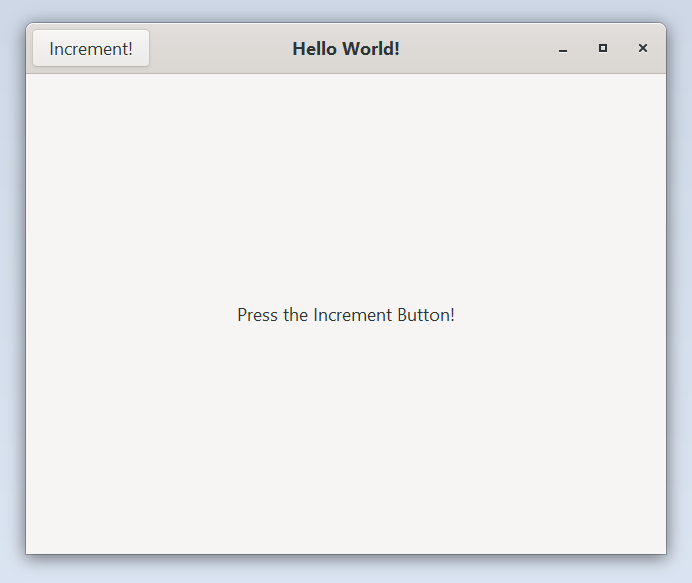

# Basic Subclass

This example creates a `GtkApplication` and a `GtkApplicationWindow` subclass
and showcases how you can override virtual funcitons such as `startup`
and `activate` and how to interact with the GObjects and their private
structs.

Run it by executing:

```bash
cargo run --bin basic_subclass
```

