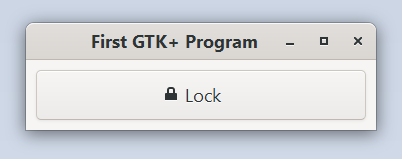

# Builder Pattern

This example demonstrates how to create a widget using the builders.
These allow to set construct-only properties and other construct
properties when creating the widget.

Run it by executing:

```bash
cargo run --bin builder_pattern
```

