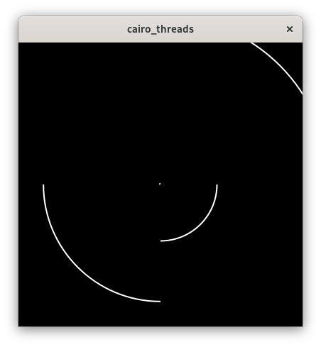

# Cairo Threads

This example runs four worker threads rendering parts of the image independently at different
paces in a sort of double buffered way.

+---+---+
| 0 | 1 |
+---+---+
| 2 | 3 |
+---+---+

Each worker thread waits for an image to render into, sleeps for a while, does the drawing, then
sends the image back and waits for the next one.
The GUI thread holds an image per image part at all times and these images are painted on a
DrawingArea in its 'draw' signal handler whenever needed.
Additionally the GUI thread has a channel for receiving the images from the worker threads. If
there is a new image, the old image stored by the GUI thread is replaced with the new one and
the old image is sent back to the worker thread. Then the appropriate part of the DrawingArea is
invalidated prompting a redraw.

The two images per thread are allocated and initialized once and sent back and forth repeatedly.

Run it by executing:

```bash
cargo run --bin cairo_threads
```


