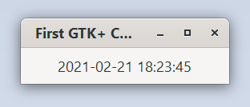

# Clock

This example demonstrates how to use `glib::timeout_add_seconds_local` to run
a periodic task, implementing a clock in this example.

Run it by executing:

```bash
cargo run --bin clock
```

