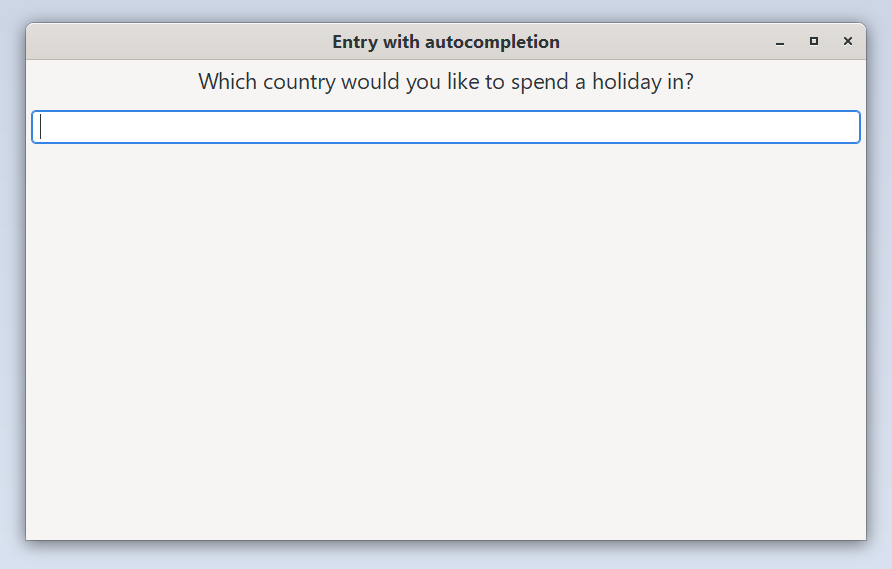

# Entry completion example

This example demonstrates how to build a list of items and use them
to autocomplete a field as the user types in something.

Run it by executing:

```bash
cargo run --bin entry_completions
```

