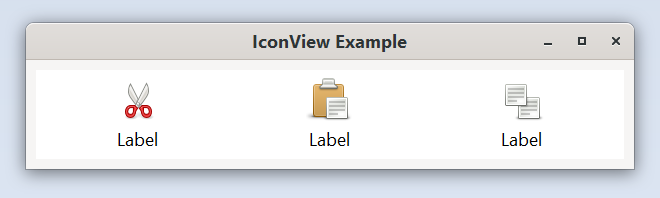

# IconView example

This example demonstrates how to create a toplevel `Window`, set its title, size and
position, how to add a `IconView` to this `Window` and how to set the model of the `IconView`

A Gtk.IconView is a widget that displays a collection of icons in a grid view.
It supports features such as drag and drop, multiple selections and item reordering.
Similarly to Gtk.TreeView, Gtk.IconView uses a Gtk.ListStore for its model.

Instead of using cell renderers, Gtk.IconView requires that one of the columns in its
Gtk.ListStore contains GdkPixbuf.Pixbuf objects.

The example is using icons from the current icon theme. To view all icons and their names please
install gtk3-icon-browser: https://developer.gnome.org/gtk3/stable/gtk3-icon-browser.html

Run it by executing:

```bash
cargo run --bin icon_view
```

