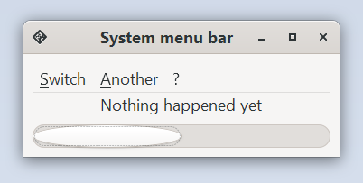

# System MenuBar example

This example demonstrates how to create a "system" menu bar. It should always be preferred
over the `gtk::MenuBar` since it adapts to the targeted system.

Run it by executing:

```bash
cargo run --bin menu_bar_system
```


