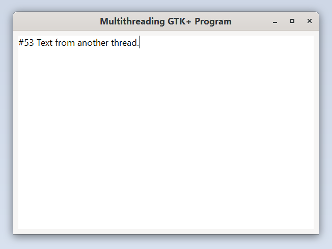

# Multi-threading Context

This example shows how to deal with multi-threaded situations by sending messages through the main context.

Run it by executing:

```console
cargo run --bin multi_threading_context
```

