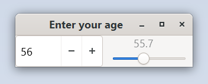

# Synchronizing Widgets

You can use property bindings in order to synchronize the values of widgets. In this example a
spin button and a horizontal scale will get interlocked.

Run it by executing:

```bash
cargo run --bin sync_widget
```

